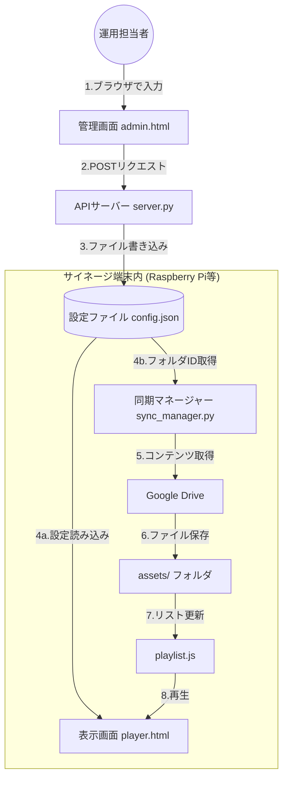

# サイネージシステム再設計・設定簡略化の実装完了報告

## 変更内容の概要
手作業でのコード編集を一切排除し、ウェブ画面から直感的に設定を変更できるアーキテクチャへの移行を完了しました。

### 1. 設定の一元管理 (JSON)
- [config.json](file:///Users/matsubaratomokiyo/Desktop/synage/config.json) を導入し、マンション名、Google Drive ID、天気の座標、ウィジェットの表示有無をすべてここで管理します。

### 2. プレミアム管理画面 (Admin)
- [admin.html](file:///Users/matsubaratomokiyo/Desktop/synage/admin.html) を作成しました。
- プレミアムなデザイン（モダンなフォーム、スイッチ、グラデーション）を採用し、スマホやPCから簡単に設定を変更できます。
- 「保存」ボタンを押すと、バックエンドの API を通じて `config.json` が即座に更新されます。

### 3. 動的サイネージプレイヤー (Player)
- [player.html](file:///Users/matsubaratomokiyo/Desktop/synage/player.html) は起動時に `config.json` を読み込みます。
- **天気ウェジェットの座標**: 設定された緯度・経度に基づき、Open-Meteo から自動でその場所の天気を取得します。
- **自由入力ウィジェット**: 管理画面で入力した「お知らせ」タイトルや内容、画像が即座に反映されます。

### 4. 同期・自動化
- [sync_manager.py](file:///Users/matsubaratomokiyo/Desktop/synage/sync_manager.py): `config.json` から Drive ID を読み込み、ファイルの同期とプレイリストの更新を自動化します。
- [setup.sh](file:///Users/matsubaratomokiyo/Desktop/synage/setup.sh): デバイス（Raspberry Pi等）への導入時に、必要なパッケージのインストールからサービスの登録までを一括で行います。

## 動作確認の手順

1. **サーバーの起動**:
   ターミナルで以下のコマンドを実行し、管理サーバーを起動します。
   ```bash
   python3 /Users/matsubaratomokiyo/Desktop/synage/server.py
   ```

2. **管理画面での編集**:
   ブラウザで `http://localhost:8000/admin.html` を開き、マンション名や天気の座標（緯度経度）を変更して「保存」をクリックします。

3. **プレイヤーでの反映確認**:
   ブラウザで `http://localhost:8000/player.html` を開きます。管理画面で変更した内容が反映されていることを確認してください。

## 運用フローとデータの流れ

実際の運用では、以下のようなルートでデータが受け渡され、サイネージに反映されます。

### データ連携図


### 各ステップの詳細解説

1.  **入力 (admin.html)**: 
    管理者がPCやスマホから「マンション名」や「表示したいウィジェット」を選択し、保存ボタンを押します。
2.  **保存 (server.py)**: 
    バックエンドのサーバーがデータを受け取り、端末内の `config.json` を上書きします。
3.  **表示の反映 (player.html)**: 
    プレイヤー画面は起動時、および定期的に `config.json` をチェックします。マンション名や天気の座標が書き換わっていれば、Javascript が即座に画面表示を更新します。
4.  **コンテンツの同期 (sync_manager.py)**: 
    バックグラウンドで動いている同期ツールが `config.json` 内の `drive_folder_id` を見に行きます。IDが変更されていれば、新しい Google Drive フォルダから画像や動画をダウンロードし、`assets/` フォルダを最新状態に保ちます。
5.  **プレイリストの生成**: 
    同期が終わると `playlist.js` が自動生成され、プレイヤーが次に再生するファイルリストとして読み込まれます。

## リモートアクセスとセキュリティについて

### 同じネットワーク内からのアクセス (既定)
通常の状態では、サイネージ端末と**同じWi-Fiや有線LANに接続しているPC・スマホからのみ**アクセス可能です。
- アドレス: `http://(端末のIPアドレス):8000/admin.html`
- 利点: 外部に公開されないため、セキュリティ的に安全。

### 外出先（外部ネットワーク）から操作したい場合
サイネージが設置されているマンションとは別の場所（事務所や自宅）から管理画面を操作したい場合は、以下の解決策があります。

1.  **VPN (Tailscale など) [おすすめ]**:
    - 各端末にアプリを入れるだけで、離れた場所にあるデバイス同士を「仮想の同じネットワーク」に繋げます。
    - 設定が非常に簡単で、セキュリティも極めて高いです。
2.  **Cloudflare Tunnel**:
    - サイネージ端末を安全にインターネット公開し、独自のURL（例: `https://admin.example.com`）を割り当てます。
    - ルーターの設定変更が不要で、非常に強力な認証機能 (Googleログインなど) も後付けできます。

## 推奨セットアップ・ワークフロー

提示いただいた「基本設定 → Tailscale → Admin設定」の流れで概ね問題ありませんが、現場でのトラブルを防ぐために以下のステップを組み込むことをお勧めします。

### 1. ラズパイ基本設定
- **OS**: Raspberry Pi OS (Lite) or FullPageOS.
- **ネットワーク**: 現場の Wi-Fi または有線 LAN。
- **リモート管理設定 (重要)**:
    - **Tailscale (VPN)**: 離れた場所からアクセスするために必須。
      ```bash
      curl -fsSL https://tailscale.com/install.sh | sh
      sudo tailscale up
      ```
      表示されたURLをブラウザで開き認証します。
    - **VNC (リモートデスクトップ)**: デスクトップ画面を操作するために必要。
      ```bash
      sudo raspi-config
      # 「3 Interface Options」→「I3 VNC」→「Yes」を選択
      ```
    - **SSH**: ターミナル操作用。`raspi-config` から有効化しておきます。

### 2. システムのデプロイ
- `setup.sh` を実行して、Nginx/Apache、Python サーバー、同期マネージャーをインストール・サービス化 (Systemd) します。
- これにより、**電源を入れるだけで自動的にサイネージが起動**するようになります。

### 3. Google Drive API の初期認証
- `sync_manager.py` が Drive からファイルを落とすために、**サービスアカウントの認証鍵（JSONファイル）**が必要になります。
- **設置方法**: 
  1. ラズパイ側でフォルダ作成: `mkdir -p ~/synage/credentials`
  2. Mac 側からファイルを送信 (例): `scp ~/Downloads/my-key.json pi@fullpageos.local:~/synage/credentials/service_account.json`
- **なぜ手動か？**: 認証鍵は極めて重要な機密情報です。GitHubやメールで送るのではなく、USBメモリやSCPを使って**直接ラズパイに送り込む**のが最も安全な方法だからです。

### 4. 管理画面での微調整
- 自分のPCから Tailscale 経由で `http://(ラズパイのIP):8000/admin.html` を開き、マンション名や天気の座標を入力。
- 正しく表示されるか確認します。

### 5. 運用・メンテナンス設定 (「他にある？」への回答)
- **自動再起動 (Cron)**: 夜間に1回再起動するようにしておくと、メモリリーク等によるフリーズを予防できます。
- **画面の省電力設定**: 夜間など、表示が不要な時間帯にモニターの電源をオフにする設定を組み込むことができます。
- **マウスカーソルの非表示**: `unclutter` というツールを入れておくと、画面上のマウスの矢印を自動で消せます。

### 6. 夜間自動再起動 (メンテナンス)
長期稼働によるシステムの「重さ」やフリーズを未然に防ぐため、**毎日午前4時**に本体を自動再起動する設定が `setup.sh` に組み込まれています。

- **設定の確認・手動変更方法**:
  ターミナルで `sudo crontab -l` を実行すると設定を確認できます。
- **時間の変更**:
  `sudo crontab -e` で編集画面を開き、`0 4 * * *` の部分を書き換えます（例：午前3時にしたい場合は `0 3 * * *`）。

---

## 管理画面 (admin.html) の使い方・設定項目

ラズパイの `http://[IPアドレス]:8000/admin.html` にアクセスすると、以下の項目を直感的に設定できます。

### 1. 基本設定
- **マンション名**: サイネージ最上部のヘッダーに太字で表示される名称です。
- **Google Drive フォルダID**: 同期したい Drive のフォルダURLから `folders/` 以降の英数字をコピーして貼り付けます。

### 2. ウィジェット表示のオン/オフ
各ウィジェット右側のスイッチで、画面に表示するかどうかを個別に切り替えられます。
- **時刻**: 現在時刻と日付。
- **天気**: 指定した座標のリアルタイム天気。
- **お知らせ**: 自由入力したテキスト（と画像）。
- **緊急連絡先**: 下部に固定表示される連絡先。

### 3. 天気予報の座標設定 (緯度・経度)
- `lat` (緯度) と `lon` (経度) を入力します。
- 東京なら `35.6895` / `139.6917` です。Google マップで場所を右クリックすると数値を取得できます。

### 4. 自由入力ウィジェット (お知らせ)
- **タイトル**: 「清掃のお知らせ」「イベント情報」など。
- **内容**: 画面に表示したいメッセージ。
- **画像URL**: `assets/image1.jpg` のようにファイル名を指定すると、メッセージの上に画像が表示されます。

### 5. 緊急連絡先
- **タイトル**: 「管理事務室」「夜間コールセンター」など。
- **電話番号**: 画面下部に大きく表示されます。

### ⚠️ 保存と反映
設定を変更したら、一番下の **「保存」** ボタンを必ず押してください。
- ボタンを押すと、ラズパイ内の `config.json` が即座に更新されます。
- 表示画面 (`player.html`) は自動的にこれを検知し、**リロードなしで**表示を切り替えます。
